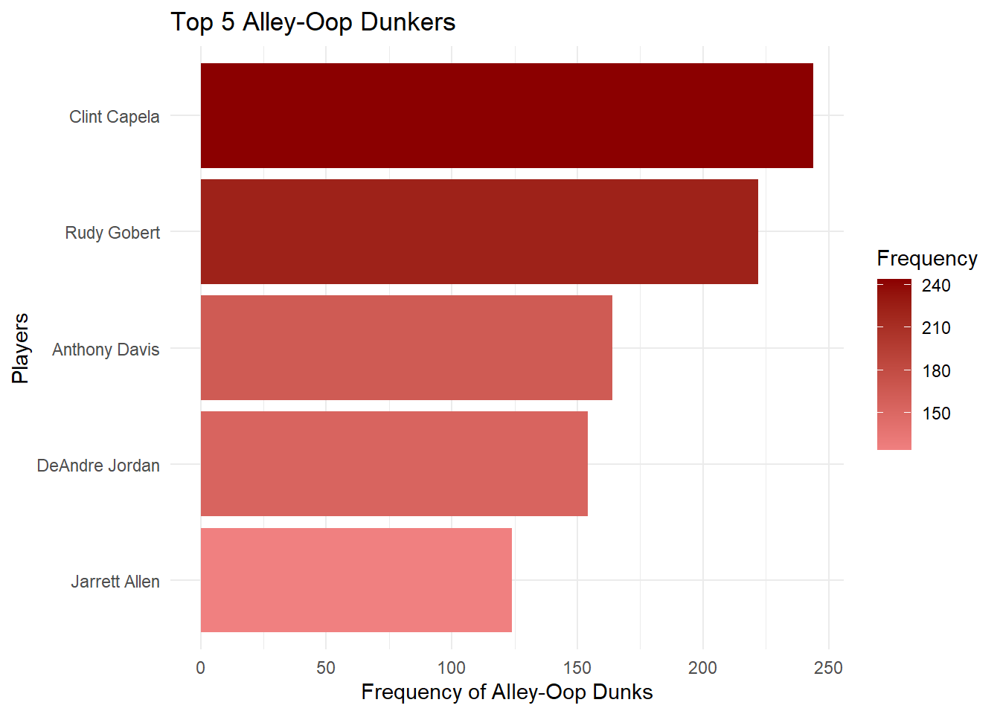
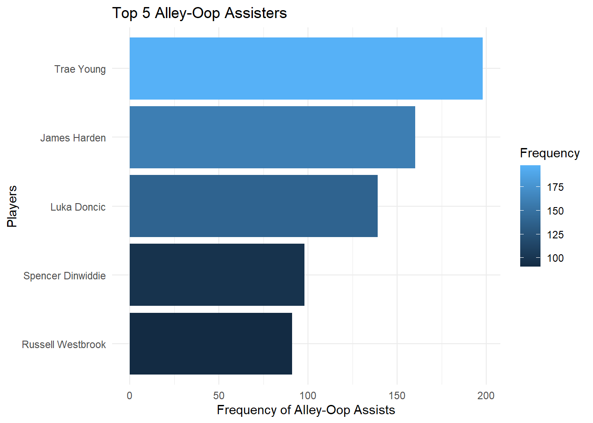
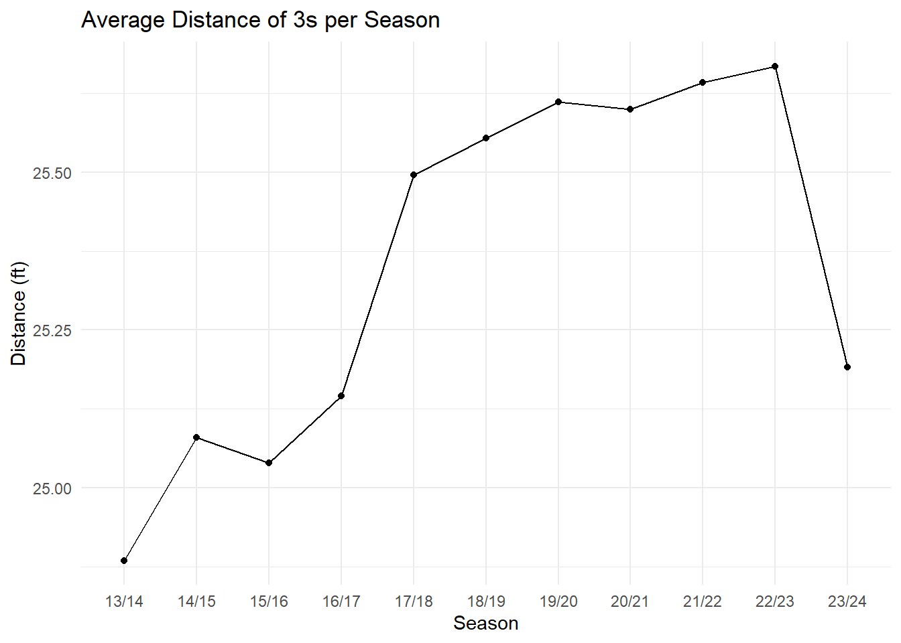
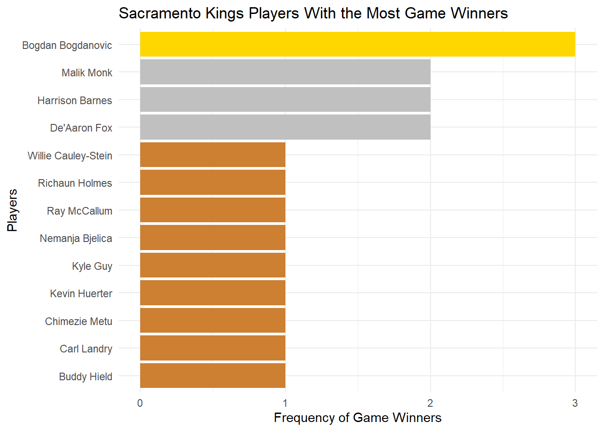

# NBA Highlight Plays Analysis (2014–2024)

This project investigates highlight plays in NBA games from 2014 to 2024, specifically focusing on alley-oop dunks, long-distance threes, and clutch shots (game winners). The data is sourced from ESPN and analyzed using R.

## Introduction

Personally, I love sports and one of my favorite sports is basketball. When watching, playing, or even gaming basketball there are 5 main plays that get me excited.

Poster dunks, chase down blocks, alley-oop dunks, ankle breakers, long distance three pointers, and game winners.

Unfortunately with the data set I have I can only analyze 3 of these 6 highlight plays: alley-oop dunks, long distance threes, and game winners.

## Primary Questions

1. Between 2014 and 2024, who contributed to the most alley-oop dunks?
2. What season contributed the most to long distance threes?
3. Which team has the clutchest players?

## Data

The data that I am using for this project can be accessed from ESPN (this is for one game):

```r
load("nba_pbp_14_24.RData")
paged_table(all_pbp_data)
```

## Data Prep for Question 1

```r
alley_oop <- all_pbp_data %>%
  filter(str_detect(description, "Alley")) %>%
  filter(str_detect(description, "Dunk")) %>%
  mutate(player_names = str_extract(description, ".*(?= makes)")) %>%
  filter(!is.na(player_names)) %>%
  filter(player_names != "Team")

top_alley_oop_players <- alley_oop %>%
  group_by(player_names) %>%
  summarise(count = n()) %>%
  arrange(desc(count)) %>%
  slice_head(n = 10)

top_alley_oop_players
```



## Data Prep for Question 2

```r
long_threes <- all_pbp_data %>%
  filter(str_detect(description, "makes 3-pt")) %>%
  mutate(distance = str_extract(description, "(?<=from )[0-9]+(?= ft)")) %>%
  filter(!is.na(distance)) %>%
  mutate(distance = as.numeric(distance)) %>%
  mutate(season = substr(game_id, 4, 5)) %>%
  filter(distance > 30)

long_three_summary <- long_threes %>%
  group_by(season) %>%
  summarise(count = n()) %>%
  arrange(desc(count))

long_three_summary
```




## Data Prep for Question 3

```r
game_winners <- all_pbp_data %>%
  filter(period == 4 | period == 5) %>%
  mutate(time_remaining = minutes_remaining * 60 + seconds_remaining) %>%
  filter(time_remaining <= 5) %>%
  filter(str_detect(description, "makes")) %>%
  filter(score_margin <= 3) %>%
  filter(!str_detect(description, "free throw")) %>%
  mutate(season = substr(game_id, 4, 5)) %>%
  mutate(team = ifelse(str_detect(description, team_1), team_1, team_2))

game_winner_summary <- game_winners %>%
  group_by(team) %>%
  summarise(count = n()) %>%
  arrange(desc(count)) %>%
  slice_head(n = 10)

game_winner_summary
```



## More Visualizations




## Summary

This analysis validated a lot of the expected outcomes.  
LeBron James contributed across categories but was not #1 in any single one.  
Stephen Curry and Damian Lillard stood out for long threes.  
DeAndre Jordan and Blake Griffin led alley-oop dunks.

## Author

Aziz Al Mezraani
